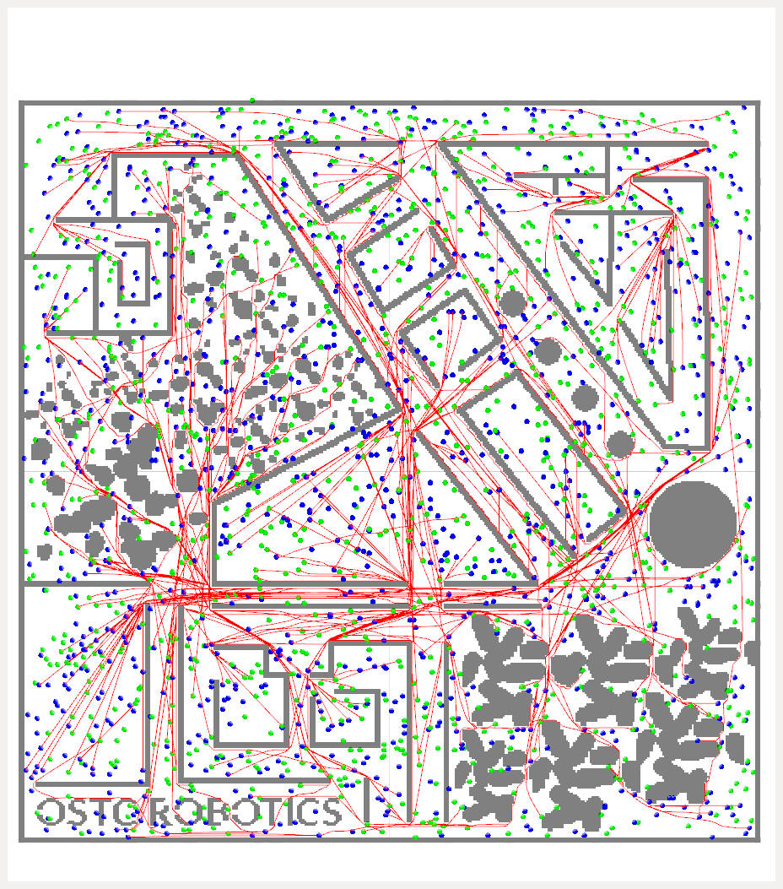

# Global Planner Component Testing

A PlannerTester node provides the world representation in the form of a costmap, sends a request to generate a path, and receives and checks the quality of the generated path.

As mentioned above, currently the world is represented as a costmap. Simplified versions of the world model and costmap are used for testing.

PlannerTester can sequentially pass random starting and goal poses and check the returned path for possible collision along the path.

Below is an example of the output from randomized testing. Blue spheres represent the starting locations, green, the goals. Red lines are the computed paths. Grey cells represent obstacles.

*Note: Currently robot size is 1x1 cells, no obstacle inflation is done on the costmap*

*Note: The Navfn algorithm sometimes fails to generate a path as you can see from the 'orphan' spheres.*